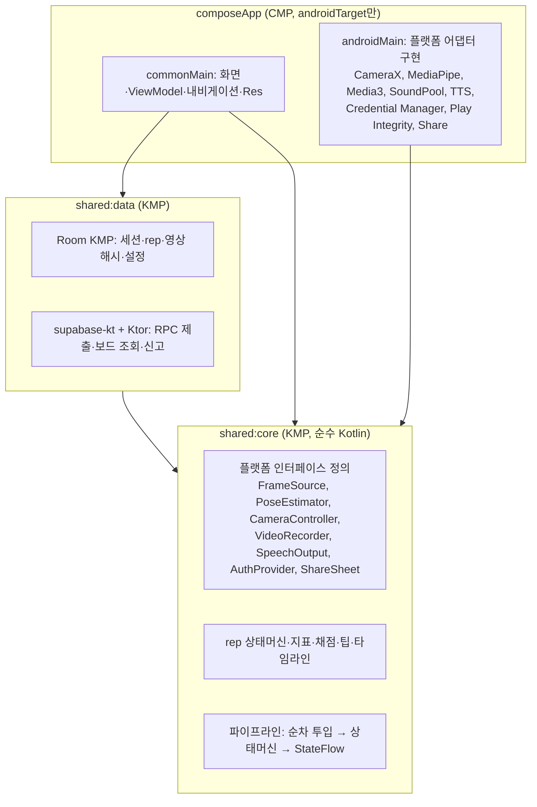
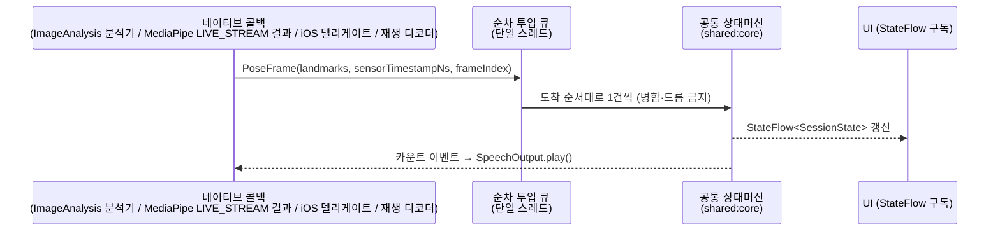

# D4. KMP 아키텍처 및 KMP/CMP 실효성 판정

- 문서 ID: D4 (`docs/architecture-kmp.md`)
- 상태: v1 초안, 2026-09-27
- 범위: MVP(Android) 아키텍처, iOS 후속 대비 경계. **이 문서에는 소스 코드·빌드 설정이 없다.** 인터페이스는 책임과 입출력만 표로 정의한다.
- 표기: **VERIFIED** = 1차 출처에서 직접 확인 / **PARTIAL** = 2차 출처로만 확인 / **UNVERIFIED** = 이번 작성에서 확인 못 함. 외부 사실의 접근일은 모두 **2026-09-27**.
- 관련 문서: `docs/PRD.md`(D1), `docs/spec-rep-detection.md`(D2), `docs/spec-posture-scoring.md`(D3), `docs/backend-cost-decision.md`(D5), `docs/validation-protocol.md`(D6)

---

## 목차

1. [KMP/CMP 실효성 판정](#1-kmpcmp-실효성-판정)
2. [모듈 구조와 의존 규칙](#2-모듈-구조와-의존-규칙)
3. [파이프라인 경계와 FrameSource 추상화](#3-파이프라인-경계와-framesource-추상화)
4. [플랫폼 인터페이스](#4-플랫폼-인터페이스)
5. [포즈 엔진 결정 항목](#5-포즈-엔진-결정-항목)
6. [오디오 지연 경로](#6-오디오-지연-경로)
7. [녹화 프리셋과 비트레이트](#7-녹화-프리셋과-비트레이트)
8. [M0 스파이크: 결과 템플릿과 저하 사다리](#8-m0-스파이크-결과-템플릿과-저하-사다리)
9. [iOS PoC 게이트](#9-ios-poc-게이트)
10. [CMP day-1 제약과 CMP 탈출 경로](#10-cmp-day-1-제약과-cmp-탈출-경로)
11. [라이브러리 결정](#11-라이브러리-결정)
12. [사실 확인 현황(UNVERIFIED 해소 기록)](#12-사실-확인-현황unverified-해소-기록)
13. [수용 기준 체크리스트(Step 4)](#13-수용-기준-체크리스트step-4)
- [부록 A. 중급기 fps AC 후보 전략(DEFERRED)](#부록-a-중급기-fps-ac-후보-전략deferred)

---

## 1. KMP/CMP 실효성 판정

### 1.1 결론

**조건부 권장(A1 채택).** 구조는 KMP `shared:core` + `shared:data` + CMP `composeApp`(androidTarget만)이다.

조건은 두 가지다. (1) iOS가 로드맵에 남아 있어야 한다. (2) 1.4의 반전 조건이 하나도 발동하지 않아야 한다. 하나라도 발동하면 해당 행의 조치를 따른다.

근거:

| 근거 | 내용 | 상태 | 출처 |
|------|------|------|------|
| K1 | Compose Multiplatform iOS는 1.8.0(2025-05)부터 Stable | VERIFIED | https://blog.jetbrains.com/kotlin/2025/05/compose-multiplatform-1-8-0-released-compose-multiplatform-for-ios-is-stable-and-production-ready/ |
| K2 | CMP 최신 stable은 v1.12.1(2026-09-22) | VERIFIED | https://github.com/JetBrains/compose-multiplatform/releases/tag/v1.12.1 |
| K3 | CMP iOS에서 `UIKitView`로 `AVCaptureVideoPreviewLayer` 카메라 프리뷰 임베드 예제가 공식 문서에 있음. 일부 API는 `@OptIn(ExperimentalForeignApi::class)` 필요 | VERIFIED | https://kotlinlang.org/docs/multiplatform/compose-uikit-integration.html |
| K5 | MediaPipe Pose Landmarker는 Android와 iOS(CocoaPods `MediaPipeTasksVision`) 가이드를 모두 제공 | VERIFIED | https://developers.google.com/edge/mediapipe/solutions/vision/pose_landmarker/ios |
| K10 | Room은 2.7.0부터 KMP stable, 최신 stable은 2.8.5 | VERIFIED | https://developer.android.com/jetpack/androidx/releases/room |
| K12 | supabase-kt 최신 stable은 3.8.0(2026-08-26) | VERIFIED | https://github.com/supabase-community/supabase-kt/releases |

### 1.2 솔직한 비용 서술

- A1의 **실질 이점은 iOS UI 재사용 하나**다. 판정·채점 로직을 격리하는 효과는 A2(Android 멀티모듈 + Gradle로 Android 의존을 금지한 순수 Kotlin/JVM `:core`)로도 똑같이 얻는다.
- iOS 전체 비용 중 **더 큰 부분은 네이티브 어댑터**다. 카메라, 녹화, 포즈 추론, TTS·오디오, 인증이 여기에 해당한다. 이 비용은 A1이든 A2든 똑같이 든다. CMP는 이 비용을 줄이지 않는다.
- A1의 대가는 Android 단계부터 치른다. Hilt 대신 Koin을 쓰고, `R` 대신 Compose Resources `Res`를 쓰고, KMP판 Navigation·Lifecycle을 쓴다(10장). 초기 빌드 설정 비용도 A2보다 크다.
- 따라서 이 판정은 "iOS UI 재작성 비용이 CMP day-1 제약 비용보다 크다"는 가정 위에 서 있다. iOS 계획이 사라지면 이 가정도 사라진다(1.4 R1).

### 1.3 공유/네이티브 표 (iOS 추가 비용 포함)

iOS 추가 비용은 Android MVP 완료 뒤 iOS를 붙일 때 새로 드는 작업량이다(1인, Swift 약함 전제, 상대 추정치). 단위: 인-주(person-week), 추정치이며 측정값이 아니다.

| 구성요소 | 위치 | 공유 여부 | Android 구현 | iOS 구현 | iOS 추가 비용 | 비고 |
|----------|------|-----------|--------------|----------|---------------|------|
| rep 상태머신·캘리브레이션·지표 계산(D2) | `shared:core` | 공유 | 공통 | 공통 | ≈0 | 순수 Kotlin, 결정적 |
| 자세 채점·실패 태그·팁 선택(D3) | `shared:core` | 공유 | 공통 | 공통 | ≈0 | 난수·시간·기기 의존 0 |
| rep 메타데이터 타임라인 생성·타당성 사전 검사 | `shared:core` | 공유 | 공통 | 공통 | ≈0 | 서버와 같은 T_floor·T_rep_min 값 |
| 로컬 DB(세션, rep, 영상 해시, 설정) | `shared:data` | 공유 | Room KMP | Room KMP(네이티브 드라이버) | 0.5 | iOS 드라이버·파일 경로 설정 |
| 리더보드 클라이언트(RPC 제출, 보드 조회, 신고) | `shared:data` | 공유 | supabase-kt + Ktor OkHttp 엔진 | supabase-kt + Ktor Darwin 엔진 | 0.5 | 엔진 교체만 |
| 화면·ViewModel·내비게이션 | `composeApp` | 공유(CMP) | CMP androidTarget | CMP iosTarget 추가 | 1–2 | iOS 관례(뒤로 가기 제스처, safe area) 조정 |
| 카메라 프리뷰·분석 프레임(`CameraController`, `CameraSource`) | 플랫폼 | 네이티브 | CameraX + `AndroidView(PreviewView)` | AVFoundation + `UIKitView` | 2–3 | Kotlin/Native에서 AVFoundation 호출 또는 Swift 브리지 |
| 녹화(`VideoRecorder`) | 플랫폼 | 네이티브 | CameraX `Recorder`/`VideoCapture` | `AVCaptureMovieFileOutput` 또는 `AVAssetWriter` | 1–3 | 9장 PoC. `AVAssetWriter`가 필요하면 상한 |
| 포즈 추론(`PoseEstimator`) | 플랫폼 | 네이티브 | MediaPipe Tasks Vision(Android) | MediaPipeTasksVision(CocoaPods) | 2 | CocoaPods 연동, 좌표계·회전 보정 |
| 영상 재생 입력(`VideoReplaySource`) | 플랫폼 | 네이티브 | Media3/MediaCodec 디코드 | `AVAssetReader` | 1 | iOS 정확도 회귀 검증용 |
| 음성 출력(`SpeechOutput`) | 플랫폼 | 네이티브 | `SoundPool` + `TextToSpeech` | `AVAudioPlayer` + `AVSpeechSynthesizer` | 0.5 | 클립 자산은 공유 |
| 인증(`AuthProvider`) | 플랫폼 | 네이티브(토큰 교환은 공유) | Credential Manager(Google) | Sign in with Apple(+Google) | 1–1.5 | App Store 정책상 Apple 로그인 필요 가능성(UNVERIFIED) |
| 기기 무결성 | 플랫폼 | 네이티브 | Play Integrity API | App Attest 등(UNVERIFIED) | 1 | D5 서버 검증 경로도 별도 |
| 공유(`ShareSheet`) | 플랫폼 | 네이티브 | `Intent.ACTION_SEND` | `UIActivityViewController` | 0.25 | 공유 카드 이미지 렌더링은 CMP 공유 |
| **합계** | | | | | **≈11–17 인-주** | 이 중 공유 영역(DB·네트워크·UI) ≈2–3, **네이티브 어댑터 ≈9–14** |

합계 행이 1.2의 서술을 수치로 보여 준다. iOS 추가 비용의 대부분은 네이티브 어댑터에서 나온다.

### 1.4 공유 비율 추정: 60–75%

**정의.** 공유 비율 = iOS 앱을 이룰 코드 중 Android와 공유하는 코드의 비율 = 공통 LOC ÷ (공통 LOC + iOS 전용 LOC). 공통 LOC는 `shared:core` + `shared:data` + `composeApp`의 commonMain이다.

**산정 방법.**
1. 1.3 표의 구성요소를 공통/Android 전용/iOS 전용으로 나눈다.
2. 구성요소마다 MVP 기능 목록(D1 F1–F4)과 D2·D3 스펙 크기로 LOC 범위를 추정한다. 테스트 코드는 뺀다.
3. 낮은 시나리오와 높은 시나리오로 비율을 계산한다.
4. **M3 종료 시 `cloc`으로 실제 LOC를 재측정**해 이 절의 수치를 갱신한다(추정 → 측정 교체).

| 구분 | 낮은 시나리오 LOC | 높은 시나리오 LOC | 근거 |
|------|------------------|------------------|------|
| `shared:core` | 3,500 | 4,500 | 상태머신·전이표, 지표·정규화, 채점 산식, 팁 선택, 타임라인 |
| `shared:data` | 2,000 | 2,500 | Room 엔티티·DAO·마이그레이션, 리포지토리, RPC DTO |
| `composeApp` commonMain | 3,500 | 5,000 | 화면 약 10개(측정, 캘리브레이션, 리포트, 히스토리, 리더보드, 설정, 계정) |
| **공통 합계** | **9,000** | **12,000** | |
| iOS 전용(어댑터 + 앱 진입점 + 플랫폼 UI 보정) | 6,000 | 4,000 | 1.3 표의 네이티브 행. 낮은 시나리오는 `AVAssetWriter` 필요·Swift 브리지 코드 많음을 가정 |
| **공유 비율** | 9,000 ÷ 15,000 = **60%** | 12,000 ÷ 16,000 = **75%** | |

비교: A2(UI 비공유)라면 공통 코드는 `:core`와 데이터 계층(약 5,500–7,000)뿐이고, iOS 전용에 UI 전체(3,500–5,000)가 더해진다. 공유 비율은 대략 **40–50%**로 떨어진다. A1과 A2의 차이(약 20–25%p)가 곧 "iOS UI 재사용"의 크기다.

### 1.5 반전 조건

아래 조건 중 하나라도 발동하면 판정을 바꾼다.

| # | 반전 조건 | 판정 방법 | 조치 |
|---|-----------|-----------|------|
| R1 | iOS 계획 폐기 | 사용자가 로드맵에서 iOS를 제거 | **A2로 단순화**: `composeApp` → Jetpack Compose Android 모듈, Koin → Hilt 선택 가능, `shared:*`는 JVM/Android 모듈로 둬도 됨 |
| R2 | M0 또는 이후 측정에서 **CMP가 원인인** 성능 문제 | 같은 화면을 Jetpack Compose로 만든 비교 빌드에서 fps·프레임 지연 차이가 재현됨 | **CMP 탈출 경로 실행**(10.2) |
| R3 | iOS PoC 불합격 | 9장 게이트 중 하나라도 불합격 | **iOS 보류**. KMP 구조는 유지하되 iOS 타깃 작업 중단, 12개월 뒤 재평가 |
| R4 | `composeApp`이 Android 전용 라이브러리 부재·비호환으로 막힘 | 막힌 이슈 해결에 **2일 초과** | **CMP 탈출 경로 실행**(10.2) |
| R5 | 채택한 KMP 라이브러리(Room KMP, supabase-kt)가 stable 채널에서 iOS 지원을 중단하거나 치명 결함이 6주 이상 방치 | 릴리스 노트·이슈 트래커 | 해당 계층만 교체(Room → SQLDelight 2.4.0, supabase-kt → Ktor로 PostgREST 직접 호출). 판정 자체는 유지 |

---

## 2. 모듈 구조와 의존 규칙

### 2.1 모듈 구조

| 모듈 | 타깃 | 역할 | 포함하지 않는 것 |
|------|------|------|------------------|
| `shared:core` | KMP (commonMain, jvm 테스트용; iOS 착수 시 iosArm64·iosSimulatorArm64 추가) | 랜드마크 시퀀스 → 카운트·채점·타임라인. 플랫폼 인터페이스 정의. 파이프라인 오케스트레이션 | 카메라, 추론 런타임, DB, 네트워크, UI |
| `shared:data` | KMP | 로컬 저장(Room KMP), 리더보드 원격 호출(supabase-kt) | 카메라, 추론, UI |
| `composeApp` | CMP, **androidTarget만** | UI, DI 조립(Koin), 플랫폼 어댑터 구현(androidMain) | 판정·채점 로직(반드시 `shared:core`) |

Android 단계의 `composeApp`은 사실상 Jetpack Compose와 같은 개발 경험이다. androidTarget만 두면 CMP 아티팩트가 Android에서 AndroidX Compose로 해석된다.

### 2.2 의존 규칙 표

| 모듈(소스셋) | 허용 의존 | **금지 의존** | 강제 방법 |
|--------------|-----------|---------------|-----------|
| `shared:core` commonMain | Kotlin stdlib, kotlinx-coroutines-core, kotlinx-serialization(타임라인 JSON) | **CameraX, MediaPipe, ML Kit, AVFoundation**, Media3, Android SDK(`android.*`), Room, Ktor, supabase-kt, Compose | KMP commonMain은 플랫폼 API를 컴파일할 수 없음 + 의존성 선언 리뷰 |
| `shared:data` commonMain | `shared:core`, Room KMP, supabase-kt, Ktor client core, kotlinx-serialization | **CameraX, MediaPipe, ML Kit, AVFoundation**, Media3, Compose | 동상 |
| `shared:data` androidMain / iosMain | Ktor 엔진(OkHttp / Darwin), Room 드라이버 | CameraX, MediaPipe, AVFoundation | 동상 |
| `composeApp` commonMain | `shared:core`, `shared:data`, CMP, Koin, Navigation·Lifecycle KMP, Compose Resources | **CameraX, MediaPipe, AVFoundation** 직접 참조 | 플랫폼 기능은 `shared:core` 인터페이스로만 접근 |
| `composeApp` androidMain | 위 전부 + CameraX, MediaPipe, Media3, SoundPool, TTS, Credential Manager, Play Integrity | 판정·채점 로직 구현(중복 금지) | 코드 리뷰 |
| (iOS 착수 시) iosMain / Swift 앱 | AVFoundation, MediaPipeTasksVision, AVSpeechSynthesizer, AuthenticationServices | 판정·채점 로직 구현 | 동상 |

핵심 규칙 한 줄: **공통 모듈(`shared:core`, `shared:data`, `composeApp` commonMain)은 CameraX·MediaPipe·AVFoundation에 의존하지 않는다.**

---

## 3. 파이프라인 경계와 FrameSource 추상화

### 3.1 FrameSource 추상화 (필수)

포즈 추정 입력은 `FrameSource` 하나로 추상화한다. 구현은 두 개다.

| 구현 | 입력 | 타임스탬프 | 프레임 드롭 | 용도 |
|------|------|------------|-------------|------|
| `CameraSource` | 실시간 카메라(Android CameraX `ImageAnalysis`, iOS `AVCaptureVideoDataOutput`) | 센서 타임스탬프(Android `ImageProxy.imageInfo.timestamp`, iOS `CMSampleBuffer` PTS) | 네이티브 쪽 `KEEP_ONLY_LATEST`에서만 허용, 드롭 수 기록 | 실사용, 실시간 fps·지연 측정 |
| `VideoReplaySource` | 녹화 파일(Android Media3/MediaCodec 디코드, iOS `AVAssetReader`) | 영상 PTS(단조 증가) | **드롭 없음**(모든 프레임 순서대로 투입, 소비 속도에 맞춰 디코드) | **정확도 검증의 결정적 실행**, 회귀 테스트, 중급기 없이 추론 fps 측정 |

두 구현 모두 같은 `PoseEstimator` → 같은 상태머신 → 같은 채점을 거친다. 차이는 입력원과 드롭 정책뿐이다.

**카메라 뷰 모드(정면/측정, 후면/자세 분석)와 `FrameSource`의 관계 (2026-09-30 사용자 결정).** `FrameSource`·`CameraSource`·`VideoReplaySource`와 3.2절 파이프라인 경계 규칙은 **뷰 모드와 무관하게 그대로 유지**한다. 카메라가 정면을 향하든 후면(등 쪽)을 향하든 동일한 `PoseEstimator`가 33개 랜드마크를 산출하고, 동일한 파이프라인(순차 투입 → 상태머신 → `StateFlow`)을 거친다. 뷰 모드는 파이프라인 구조를 바꾸지 않고, **세션 파라미터**로서 상태머신·채점 계층에 전달되어 다음을 선택하는 역할만 한다.
- `captureMode = FRONT_MEASURE`: D2(`docs/spec-rep-detection.md`)의 정면 기준 rep 판정 규칙 세트(턱-바, 하단 완전 신전 등)를 적용.
- `captureMode = BACK_POSTURE`: D2의 후면 판정 규칙 세트(정면 시야가 필요한 판정은 근사·비활성화하고 "추정" 카운트로 처리)와, D3(`docs/spec-posture-scoring.md`)의 후면 전용 채점 항목(어깨 으쓱임, 팔꿈치 벌어짐, 추정 견갑골 사용, 좌우 대칭 등) 가중치 세트를 적용.

즉 D2 규칙 세트·D3 가중치 세트의 선택은 `shared:core` 상태머신·채점 로직 내부에서 `captureMode` 값으로 분기하며, `FrameSource` 추상화나 2.2절 의존 규칙, 3.2절 파이프라인 규칙에는 영향을 주지 않는다.

**VideoReplaySource가 필수인 이유.**
- 사용자는 중급기 실기기가 없다(Galaxy Z Flip7만 보유). D6의 정확도 AC(n ≥ 100세트, ≥95% ±1)는 실시간 카메라로 반복 측정할 수 없다. 녹화된 데이터셋을 영상 재생 경로로 돌려야 같은 입력 → 같은 결과를 매번 얻는다.
- 결정성 조건: (1) 모든 프레임 투입(드롭 0), (2) 포즈 엔진은 영상 모드(MediaPipe `VIDEO` running mode, 동기 호출)로 실행, (3) 추론 델리게이트는 CPU 고정(GPU는 부동소수 결과가 기기·드라이버마다 다를 수 있음), (4) 엔진·모델 버전을 결과에 기록. 이 네 가지를 지키면 같은 기기·같은 빌드에서 결과가 바이트 단위로 같아야 한다. 다르면 결함으로 본다.
- 실시간 fps·지연 AC만 실기기(`CameraSource`)로 측정한다(D6).

### 3.2 파이프라인 경계 규칙

| # | 규칙 | 내용 |
|---|------|------|
| P1 | **순차** | 모든 `PoseFrame`은 단일 스레드(단일 병렬도 디스패처)에서 도착 순서대로 상태머신에 투입한다. 상태머신은 동시 호출을 받지 않는다. |
| P2 | **무병합(no conflation)** | 네이티브 → 공통 경계에서 프레임 결과를 합치거나 버리지 않는다. 큐는 무제한 버퍼 또는 역압(backpressure)으로 대기시킨다. "최신값만 유지" 방식의 흐름(conflate, `StateFlow`)을 **입력 경로에 쓰지 않는다.** |
| P3 | **드롭 위치 단일화** | 프레임 드롭은 네이티브 입력 단(CameraX `STRATEGY_KEEP_ONLY_LATEST`, iOS `alwaysDiscardsLateVideoFrames`, 엔진이 바쁠 때 입력을 무시하는 동작)에서만 허용한다. 드롭 수는 세션 로그에 남긴다. `VideoReplaySource`는 드롭 0. |
| P4 | **단조 센서 타임스탬프** | 시간 판정(체류, 히스테리시스, 가림 캡 300 ms, rep 소요 시간)은 모두 센서 타임스탬프(ns → ms)로 한다. 벽시계(`System.currentTimeMillis`, `Date`)와 프레임 수 사용 금지. 직전보다 작거나 같은 타임스탬프가 오면 그 프레임을 버리고 오류 카운터를 올린다(D5 서버 비단조 거부와 같은 원칙). |
| P5 | **StateFlow 출력** | 공통 파이프라인의 UI 출력은 `StateFlow`(현재 카운트, 상태, 품질 경고, fps)로만 한다. UI는 조회만 하고 상태를 바꾸지 않는다. 카운트 이벤트처럼 한 번만 소비해야 하는 신호는 별도 이벤트 스트림으로 보낸다. |
| P6 | **음성 트리거 위치** | 카운트 이벤트 발생 즉시 파이프라인 스레드에서 `SpeechOutput`을 호출한다(UI 스레드 경유 금지). 지연 예산은 D2. |
| P7 | **좌표 정규화 경계** | 회전·미러링 보정은 어댑터(네이티브)에서 끝내고, 공통 모듈은 "세로 기준, 미러링 없음" 좌표만 받는다. 어깨폭 S 기준 정규화는 공통(D2). |
| P8 | **카메라 목표 프레임률 30 고정** | `CameraSource` 캡처 설정에서 목표 프레임률을 30으로 고정한다(예: CameraX `setTargetFrameRate(30, 30)`에 해당하는 설정). 1차 M0(8.2)에서 VideoCapture 없이 Preview + ImageAnalysis만 바인딩하자 실내 조명에서 AE가 카메라를 15 fps로 내렸고, 목표 30 지정 시 p50 28 / p5 24로 회복했다. VideoCapture를 바인딩한 경우에도 같은 설정을 명시한다. |

---

## 4. 플랫폼 인터페이스

모든 인터페이스는 `shared:core` commonMain에 정의하고, 구현은 플랫폼 소스셋(Android: `composeApp` androidMain, iOS: iosMain 또는 Swift)에 둔다. iOS 위험도: 상 = PoC 없이는 일정 추정 불가 / 중 = 알려진 난관 있음 / 하 = 표준 API로 해결.

| 인터페이스 | 책임 | 입력 → 출력 | Android 기술 | iOS 기술 | iOS 위험도 | 위험 근거 |
|------------|------|-------------|--------------|----------|------------|-----------|
| `FrameSource` | 분석용 프레임 공급(실시간 또는 재생) | 시작/정지 → 프레임 스트림(이미지 + 단조 타임스탬프) | `CameraSource`: CameraX `ImageAnalysis`(YUV_420_888 또는 RGBA_8888 출력) / `VideoReplaySource`: Media3·MediaCodec | `CameraSource`: `AVCaptureVideoDataOutput` / `VideoReplaySource`: `AVAssetReader` | 중 | Kotlin/Native에서 `CMSampleBuffer`·`CVPixelBuffer` 다루기, 회전 처리 |
| `PoseEstimator` | 프레임 → 33 랜드마크 + visibility | 프레임 + 타임스탬프 → `PoseFrame` 또는 "인물 없음" | MediaPipe Tasks Vision `PoseLandmarker`(LIVE_STREAM / VIDEO 모드) | MediaPipeTasksVision(CocoaPods) | 상 | CocoaPods ↔ Kotlin/Native cinterop 또는 Swift 브리지 필요, 공식 KMP 래퍼 없음(K7, UNVERIFIED) |
| `CameraController` | 카메라 수명주기, 전/후면 선택, 프리뷰 뷰 제공, 하드웨어 레벨·해상도 보고 | 설정 → 프리뷰 뷰 + 카메라 정보 | CameraX `ProcessCameraProvider`, `PreviewView`를 `AndroidView`로 임베드 | `AVCaptureSession` + `AVCaptureVideoPreviewLayer`를 `UIKitView`로 임베드(K3 VERIFIED) | 중 | 세션 구성 코드를 Kotlin/Native에서 작성, `ExperimentalForeignApi` |
| `VideoRecorder` | 엄격 세션 녹화(720p/30fps/목표 0.85 Mbps, 7장), 종료 후 파일 경로·SHA-256 계산 트리거 | 시작/정지 → 파일 URI | CameraX `VideoCapture` + `Recorder`(`setTargetVideoEncodingBitRate`, 7장) | `AVCaptureMovieFileOutput` 또는 `AVAssetWriter` | 상 | 분석 출력과 녹화 동시 구동(9장). iOS 16 미만 링크 시 동시 활성 불가, `AVAssetWriter`로 가면 Swift 부담 증가 |
| `SpeechOutput` | 카운트 음성(사전 합성 클립 1–100, "노카운트"), 100 초과는 TTS | 숫자·이벤트 → 소리, `play()` 호출 타임스탬프 기록 | `SoundPool`(사전 로드) + `TextToSpeech`(prewarm), 필요 시 Oboe/AAudio(6장) | `AVAudioPlayer`(`prepareToPlay`) + `AVSpeechSynthesizer` | 하 | 표준 API. 오디오 세션 카테고리 설정만 주의 |
| `AuthProvider` | 소셜 로그인 → Supabase 세션 | 로그인 요청 → ID 토큰 → supabase-kt 세션 | Credential Manager(Google ID 토큰) → supabase-kt `signInWith(IDToken)` | Sign in with Apple(AuthenticationServices), Google Sign-In | 중 | Apple 로그인 필수 여부 등 App Store 정책(UNVERIFIED), 웹뷰 리디렉션 설정 |
| `ShareSheet` | 기록 공유 카드(이미지 + "미검증" 표기) 공유 | 이미지·텍스트 → 시스템 공유 | `Intent.ACTION_SEND` + `FileProvider` | `UIActivityViewController` | 하 | 표준 API |

보조(인터페이스 목록 외, 같은 원칙): 기기 무결성(`IntegrityTokenProvider`: Android Play Integrity Standard 요청, iOS는 PoC 때 결정), 저장 공간 조회(로컬 영상 보관 용량 표시).

---

## 5. 포즈 엔진 결정 항목

| 후보 | 상태 | 장점 | 단점 |
|------|------|------|------|
| **MediaPipe Pose Landmarker lite (기본안)** | tasks-vision 1.0.0 stable(K6) | 가장 빠름, Android·iOS 공식 가이드, 33점 + 월드 좌표, VIDEO 모드로 결정적 재생 가능 | full보다 정확도 낮을 수 있음(상단 가림 구간) |
| MediaPipe Pose Landmarker full | 동상 | 정확도 향상 가능 | 추론 비용 증가, 녹화 동시 구동 시 20fps 여유 감소 |
| ML Kit Pose Detection base | **beta**(18.0.0-beta5), SLA·폐기 정책 비적용(K8) | 통합 쉬움, Android·iOS | beta라 유지보수 리스크, 모델 교체·버전 고정 제어 약함 |

**결정 기준(우선순위 순):**
1. **M0 fps(녹화 on)**: Flip7 3-use-case 구동 p50 ≥ 20 fps, p5 ≥ 15 fps. 영상 재생 경로의 추론 fps로 먼저 거른다.
2. **D6 정확도**: `VideoReplaySource`로 같은 데이터셋을 돌려 ±1 비율과 엄격 모드 노카운트 재현율 비교(D6 포즈 엔진 비교 절차).
3. **유지보수 리스크**: ML Kit beta(K8)는 동률일 때 감점.

**결정 규칙.** 기본안은 MediaPipe lite다. full이 lite보다 D6 정확도를 의미 있게(±1 비율 +3%p 이상) 올리면서 fps 기준을 통과하면 full로 바꾼다. ML Kit는 MediaPipe 두 모델이 모두 fps 기준에 떨어질 때만 채택한다. 결정 결과와 버전은 이 절과 rep 메타데이터 타임라인의 `poseEngine` 필드에 기록한다.

결정 기록란(M0·D6 후 채움):

| 항목 | 값 |
|------|-----|
| 채택 엔진·모델 | (미정) |
| 버전 | (미정) |
| 근거 수치(fps p50/p5, ±1 비율) | (미정) |
| 결정일 | (미정) |

1차 M0(2026-09-30, 8.2) 잠정: MediaPipe lite 유지, GPU 위임 우선. 실카메라 측정에 사람이 없어 lite·full 비교가 안 됐으므로 이 표는 재측정 후 채운다.

---

## 6. 오디오 지연 경로

D2 지연 예산: 내부 구간(TOP 최초 충족 프레임 → `play()` 호출) ≤ 285 ms, 외부 구간(물리적 TOP → 실제 소리) ≤ 435 ms. AC는 외부 측정 **p95 ≤ 500 ms, 최대 ≤ 600 ms**. 이 중 오디오 출력 지연(`play()` → 소리)에 **100 ms**를 배정했다.

| 단계 | 경로 | 조건 |
|------|------|------|
| 기본 | **사전 합성 클립**(숫자 1–100, "노카운트")을 세션 시작 전 `SoundPool`에 로드하고 이벤트 때 `play()`만 호출. 합성 지연 0 | 항상 |
| 100 초과 | `TextToSpeech`. 세션 시작 시 엔진 초기화·짧은 무음 발화로 prewarm | 100회 초과 세트(고정 rep 상한은 없음) |
| 저지연 교체 | **AAudio/Oboe**(저지연 스트림에 PCM 클립 직접 믹싱) 또는 `AudioTrack` 저지연 모드 | M0 또는 D6에서 `play()` → 소리 **p95 > 100 ms**일 때 |
| iOS | `AVAudioPlayer`(`prepareToPlay` 선호출), 100 초과는 `AVSpeechSynthesizer` | iOS 착수 시, 같은 100 ms 기준 |

측정: `SoundPool`에는 재생 시작 콜백이 없으므로, 내부 구간 종료점은 `play()` 호출 타임스탬프다. 실제 소리 시점은 D6의 240fps 슬로모션 외부 측정으로만 판정한다.

---

## 7. 녹화 프리셋과 비트레이트

- 엄격 세션 녹화는 MVP부터 **증빙 호환 프리셋: 720p / 30fps / 목표 0.85 Mbps**로 저장한다(D5 2.2B: 과거 PB를 Phase 2에서 재인코딩 없이 원본 그대로 제출, 16 MB 상한). 목표 0.85 Mbps에 실측 오버슈트 최대 14%를 적용하면 약 0.97 Mbps이고, **128초 ≤ 약 15.5 MB**다(80초 ≈ 9.7 MB). 16 MB 상한과 G1 계산(D5)은 바꾸지 않는다.
- **2026-09-30 변경(1차 M0 결과).** 초안 목표는 1.0 Mbps였다. Flip7 실측(60초 × 4회)에서 영상 스트림이 1.01–1.14 Mbps(목표 대비 +1–14%), 컨테이너 전체가 1.06–1.19 Mbps(+6–19%)로 나와 128초 환산 16.9–19.0 MB가 16 MB 상한을 넘었다. 그래서 목표를 0.85 Mbps로 낮췄다.
- **CameraX `Recorder` 목표 비트레이트: VERIFIED.** `Recorder.Builder.setTargetVideoEncodingBitRate(bitrate: Int)`가 CameraX **1.3.0부터** 있다. 문서 설명: 실제 비트레이트를 요청값 근처로 유지하려 하지만 장면에 따라 달라질 수 있고, 플랫폼 능력에 맞춰 내부적으로 바뀔 수 있으며, 오디오 비트레이트에는 영향이 없다. 출처: https://developer.android.com/reference/kotlin/androidx/camera/video/Recorder.Builder (접근 2026-09-27).
- 남은 확인(M0): API는 있지만 "근사치"이므로 **Flip7에서 60초·120초 녹화의 실제 파일 크기와 평균 비트레이트**를 측정한다. 1차 M0에서 목표 1.0 Mbps 설정 호출은 기기에서 동작했지만(VERIFIED) 실제 값이 목표를 넘었다(위 변경). **목표 0.85 Mbps로 기기에서 다시 잰다.** 판정은 영상 스트림 비트레이트가 아니라 **컨테이너 파일 크기**로 한다(1차 측정에서 컨테이너가 스트림보다 약 0.05 Mbps 컸다). 128초 환산 파일이 16 MB를 넘으면 목표를 0.8 Mbps로 낮추고 다시 잰다.
- 폴백(실측이 상한을 지키지 못할 때만): 세션 종료 직후 WorkManager로 Media3 Transformer 1회 재인코딩, **그 결과 파일**을 보관·해시(D5 2.2B 폴백과 같음). 이 경우 재인코딩 시간·배터리 측정을 MVP M0로 되돌린다.
- 포즈 분석(ImageAnalysis)은 녹화 비트레이트와 무관하다.

---

## 8. M0 스파이크: 결과 템플릿과 저하 사다리

### 8.1 M0 정의

- 시점: 문서 승인 직후, 실행 단계 첫 작업. 스파이크 코드는 버린다(throwaway).
- 기기: **Galaxy Z Flip7 (SM-F766N, Exynos 2500, Android 16 / API 36, 12 GB, 후면 카메라 하드웨어 레벨 FULL — adb 확인)**. 플래그십이므로 측정값은 **성능 상한 참고치**다.
- 순서: **영상 재생 입력(`VideoReplaySource`) 측정을 먼저** 한다(카메라 없이 추론 fps, 변환 비용, 결정성). 그다음 실카메라 3-use-case와 오디오 지연을 잰다.
- **중급기 ≥20 fps AC는 DEFERRED.** 중급기 실기기를 확보할 때 수행하며 출시 게이트에서 제외한다. 후보 전략은 [부록 A](#부록-a-중급기-fps-ac-후보-전략deferred).
- Flip7 스트림 공유 주의: CameraX는 FULL 이하 하드웨어 레벨에서 Preview·ImageAnalysis·VideoCapture 동시 사용 시 stream sharing을 쓸 수 있고 지연·배터리가 늘 수 있다(K9, VERIFIED, https://developer.android.com/media/camera/camerax/architecture). Flip7 후면이 FULL이므로 이 경로에 해당할 수 있다 — M0에서 실제 적용 여부를 기록한다.
- 결과를 이 절의 템플릿에 채우고, D2 임계값·D6 기기 목표를 재조정한다.

### 8.2 M0 결과 템플릿

**A. 영상 재생 입력 측정(선행)** — 입력: 1080p/30fps 풀업 영상 3개(정면·후면·저조도), 각 60초 이상. **2026-09-30 사용자 결정**: 카메라 뷰는 정면(측정 모드)·후면(자세 분석 모드) 2종만 지원하며 45° 사선 뷰는 MVP 범위에서 제외되어(D1 2.1) 45° 샘플 영상은 더 이상 필요하지 않다.

| # | 항목 | 조건 | 지표 | 결과 | 합격 기준 |
|---|------|------|------|------|-----------|
| A1 | 추론 fps — MediaPipe lite | VIDEO 모드, CPU | p50 / p5 fps, 추론 ms/프레임 p50/p95 | 1차: 37.4–44.6 / 42.6–50.4 ms, 22–27 fps(아래 표) | 참고(상한치) |
| A2 | 추론 fps — MediaPipe full | 동상 | 동상 | 1차: 54.1–59.8 / 68.2–109.2 ms, 17–19 fps | 참고 |
| A3 | 추론 fps — ML Kit base | 동상 | 동상 | 1차 미측정 | 참고 |
| A4 | GPU 델리게이트 fps(MediaPipe lite/full) | 참고용, 정확도 검증에는 미사용 | p50 fps | 1차: lite 31–43, full 27–35 fps(CPU 대비 1.4–2.1배) | 참고 |
| A5 | 디코드 프레임 → 엔진 입력 변환 비용 | 비트맵/RGBA 변환 | ms/프레임 p50/p95 | 1차: 디코드 20–26 / 24–33 ms, MPImage 감싸기 < 0.05 ms | 기록 |
| A6 | 결정성 | 같은 영상 3회 반복 | 카운트·타임라인 일치 여부 | 1차: 후면 lite CPU 3회 일치(크루드 카운터 기준) | 3회 완전 일치 |

**B. 실카메라 측정(Flip7)** — 조건마다 60초 연속 3회.

| # | 항목 | 조건 | 지표 | 결과 | 합격 기준 |
|---|------|------|------|------|-----------|
| B1 | 카메라 하드웨어 레벨 | 후면 | LEGACY/LIMITED/FULL/LEVEL_3 | FULL(adb 사전 확인, 1차 M0에서 앱으로 재확인) | 기록 |
| B2 | stream sharing 적용 여부 | 3 use case 바인딩 | 적용/미적용 | 1차: 적용 | 기록 |
| B3 | 3 use case 동시 분석 fps — 녹화 off | Preview + ImageAnalysis, 엔진별 | p50 / p5 fps | 1차 lite: 2 use case 15 / 14 → 목표 30 fps 지정 시 28 / 24(P8) | p50 ≥ 20, p5 ≥ 15 |
| B4 | 3 use case 동시 분석 fps — **녹화 on** | Preview + ImageAnalysis + VideoCapture(720p/30/목표 0.85 Mbps, 1차는 1.0 Mbps로 측정), 엔진별 | p50 / p5 fps | lite 28 / 25, full 29 / 27(1차, 사람 없음) | **p50 ≥ 20, p5 ≥ 15** |
| B5 | YUV → RGB/비트맵 변환 비용 | ImageAnalysis 출력 형식별(YUV_420_888, RGBA_8888) | ms/프레임 p50/p95 | 1차 RGBA_8888: 0.3–0.5 / 1.3–3.0 ms | 기록(예산: 센서→분석기 ≤ 50 ms 안) |
| B6 | 분석 입력 드롭률 | KEEP_ONLY_LATEST | 드롭 프레임 / 전체 | 1차: 2.8–10.6% | 기록 |
| B7 | 오디오 출력 지연 | `SoundPool.play()` → 소리(240fps 슬로모션 또는 루프백) | p50 / p95 ms | 1차 미측정 | **p95 ≤ 100 ms**, 초과 시 6장 저지연 교체 |
| B8 | 녹화 실제 비트레이트·크기 | 60초 / 120초 | MB, 평균 Mbps | 1차(목표 1.0, 60초만): 스트림 1.01–1.14 Mbps, 128초 환산 16.9–19.0 MB → **불합격**, 목표 0.85로 재측정(7장) | 128초 환산 ≤ 16 MB |
| B9 | 카메라 오버헤드 비율 | B4 fps ÷ A1(또는 채택 엔진) fps | 비율 | 1차 산출 보류(B4에 사람 없음) | 기록(부록 A 전략 2) |
| B10 | 발열·스로틀링 | 10분 연속 녹화 on | 10분 시점 fps / 시작 fps | 1차 미측정(60초 런 중 thermal 0→1) | 기록 |

**C. Phase 2 선행 측정(MVP M0 범위 밖)** — 증빙 재인코딩(P1-H)의 60초/120초 소요 시간·배터리(WorkManager, 충전 조건 없음). Phase 2 착수 전에 측정한다. 단, 7장 폴백이 발동하면 MVP M0로 되돌린다.

#### 1차 M0 결과 (2026-09-30, Flip7, 참고치)

원자료는 비공개 파일 `docs/private/dataset/results/m0-flip7-20260930.md`·`m0-flip7-20260930.json`과 데스크톱 사전 측정 `docs/private/dataset/results/m0-desktop-20260930.json`에만 둔다. 이 값은 **성능 상한 참고치**이며 AC4 합격 근거로 쓰지 않는다(D6 §6.2). 스파이크 코드는 버렸다.

**환경.** Galaxy Z Flip7(8.1과 같음). 라이브러리: MediaPipe `tasks-vision` **1.0.0**, CameraX **1.6.2**(core/camera2/lifecycle/video/view). 빌드: AGP **9.4.1** / Gradle **9.6.1** / JDK **21**, compile·target SDK 36, release 빌드. 모델: `pose_landmarker_lite.task`, `pose_landmarker_full.task`. 조건: **충전 중, 화면 켬, 메모리 부하 높음**(시작 시 거의 가득 참), 런 사이 휴식 60초(프로토콜은 2분). 발열: 재생 측정 전 구간 thermalStatus 0, 실카메라 측정 중 **0 → 1**(LIGHT).

**A. 영상 재생(VIDEO 모드).** fps = 1000 / 추론 ms. 입력은 정면 1개·후면 1개(템플릿 조건인 1080p·60초 이상·3개와 다름, 아래 주의). 검출률은 모든 런에서 1.0.

| 영상 | 모델 | 위임 | 추론 p50 / p95 ms | fps p50 / p5 |
|---|---|---|---|---|
| 후면(405×720, 24fps) | lite | CPU | 37.4 / 42.6 | 26.8 / 23.5 |
| 〃 | lite | GPU | 23.5 / 30.0 | 42.6 / 33.4 |
| 〃 | full | CPU | 59.8 / 109.2 | 16.7 / 9.2 |
| 〃 | full | GPU | 28.4 / 36.4 | 35.2 / 27.5 |
| 정면(1050×1650, 30fps) | lite | CPU | 44.6 / 50.4 | 22.4 / 19.9 |
| 〃 | lite | GPU | 32.0 / 44.7 | 31.3 / 22.4 |
| 〃 | full | CPU | 54.1 / 68.2 | 18.5 / 14.7 |
| 〃 | full | GPU | 37.0 / 49.1 | 27.0 / 20.4 |

- 변환 비용(A5): 디코드 + YUV→RGB가 프레임당 p50 **20–26 ms**(p95 24–33 ms). Bitmap → MPImage 감싸기는 **0.05 ms 미만**. 디코드를 포함한 종단 처리량은 12–23 fps다.
- 결정성(A6): 후면 lite CPU 3회에서 카운트·TOP 시각이 모두 같았다. 추론 ms는 회차마다 흔들렸다(p50 34.1–37.4 ms).
- GPU 위임은 CPU보다 **1.4–2.1배** 빨랐다. GPU 초기화는 0.4–0.6초로 CPU보다 길다.

**B. 실카메라(후면, LIVE_STREAM, CPU, 60초 창).** 분석 스트림 640×480 RGBA_8888, `KEEP_ONLY_LATEST`. fps는 결과 콜백 수를 1초 창마다 센 값이다.

| 런 | use case | 녹화 | fps p50 / p5 | 추론 p50 / p95 ms | 드롭률 |
|---|---|---|---|---|---|
| lite, 3회 합산(180개 창) | 3 | on | **28 / 25** | 41–55 / 70–77 | 4.7–10.4% |
| full, 1회 | 3 | on | **29 / 27** | 40 / 67 | 2.8% |
| lite, VideoCapture 바인딩·녹화 안 함 | 3 | off | 27 / 25 | 54 / 78 | 10.6% |
| lite, Preview + Analysis만 | 2 | off | **15 / 14** | 55 / 73 | 0% |
| lite, 2 use case + 목표 30 fps | 2 | off | 28 / 24 | 47 / 73 | 6.9% |

- 하드웨어 레벨 **FULL**(B1). **stream sharing 적용됨**(B2): VideoCapture를 바인딩한 모든 런에서 확인, 2 use case 런에서는 없음.
- 실제 스트림: 분석 **640×480**, 프리뷰 **1080×1440**, 녹화 **720×1280**.
- 변환(B5): `ImageProxy.toBitmap()`(RGBA_8888) p50 0.3–0.5 ms, p95 1.3–3.0 ms.
- 비트레이트(B8): `setTargetVideoEncodingBitRate(1_000_000)` 호출은 기기에서 동작했다(**VERIFIED**). 실제 영상 스트림은 **1.01–1.14 Mbps**(목표 대비 +1–14%), 컨테이너 전체는 1.06–1.19 Mbps(+6–19%), 29.9 fps, H.264, 오디오 없음. 128초 환산 16.9–19.0 MB로 16 MB 상한을 넘어 목표를 0.85 Mbps로 낮췄다(7장).
- 카메라 입력이 30 fps라 분석 fps의 상한은 카메라 fps다.

**주의(이 결과로 확정할 수 없는 것).**
1. **실카메라 런 전부에 사람이 화면에 없었다.** 이때 MediaPipe는 사람 검출기만 돌고 랜드마크 모델은 돌지 않는다. 그래서 B의 lite·full 수치가 거의 같고, 실제 세션과 부하가 다르다. **B로는 lite와 full을 비교할 수 없다.**
2. 재생 입력은 60초보다 짧고(정면 35.7초, 후면 17.8초) 1080p가 아니며 2개뿐이다.
3. 충전 중·화면 켬·메모리 부하 높음·휴식 60초 조건이다. **ML Kit(A3), 오디오 지연(B7), 10분 발열(B10)은 하지 않았다.** B8은 60초 녹화만 쟀다.

**결정과 후속 작업.**
- **(a) 포즈 엔진 기본값은 MediaPipe lite 유지, GPU 위임 우선.** 재생 경로에서 GPU가 CPU보다 1.4–2.1배 빨랐다(GPU 초기화 0.4–0.6초). 최종 결정(5장 결정 기록란)은 사람이 화면에 있는 실카메라 측정 후에 한다.
- **(b) 카메라 목표 프레임률 30 지정(3.2 P8).** VideoCapture를 바인딩하지 않으면 실내 조명에서 카메라가 15 fps로 내려갔다. 캡처 설정에 목표 프레임률 30(예: `setTargetFrameRate(30, 30)`)을 넣자 p50 28 / p5 24가 됐다. 8.3 저하 사다리를 적용하기 전에 이 설정이 들어가 있는지 먼저 확인한다.
- **(c) 스레드 배치 튜닝(후속).** 기기 CPU 추론이 데스크톱(lite 7.7 ms, full 12.7 ms)보다 4–5배 느렸고, 추론 스레드가 중간 코어에 배치되고 prime 코어는 쓰이지 않았다. 스레드 우선순위·코어 지정 튜닝은 후속 작업이다.
- **(d) 정확도는 D2 구현으로 평가한다.** 데스크톱·기기 스파이크의 크루드 카운터는 D2 알고리즘이 아니며 크게 적게 셌다(정면 정답 22 → 6–13, 후면 정답 12 → 7–9). 정확도는 D2 구현을 `VideoReplaySource`로 돌려 D6 절차로 평가한다. M0 정면 클립은 촬영 가이드를 어겼다(카메라 고정 안 됨, 피사체가 프레임 높이의 약 40%)(D6 §2.3-C).
- **(e) 녹화 목표 비트레이트 0.85 Mbps로 하향, 기기에서 재측정(7장).**
- 재측정 계획(사람 있는 실카메라, 2분 휴식, 충전 안 함, 10분 발열, 오디오 지연)은 D6 §6.2에 둔다.

### 8.3 저하 사다리 (20 fps 미달 시)

B4(녹화 on)가 p50 < 20 fps 또는 p5 < 15 fps면 아래 순서로 한 단계씩 적용하고, 매 단계 B4를 다시 잰다. 기준을 넘는 첫 단계에서 멈춘다.

| 단계 | 조치 | 기대 효과 | 대가 |
|------|------|-----------|------|
| ① | **분석 해상도 하향**(예: 640×480 → 480×360) | 변환·추론 비용 감소 | 원거리 랜드마크 정밀도 저하 → D6 정확도 재확인 |
| ② | **VideoCapture 화질 SD/480p로 하향** | 인코더·스트림 부하 감소 | 증빙 화질 저하. 480p도 16 MB 상한은 지킴 |
| ③ | **포즈 엔진/모델 교체**(full → lite, MediaPipe ↔ ML Kit) | 추론 비용 감소 | 정확도 변화 → 5장 결정 재평가 |
| ④ | **분석 프레임 기반 인코딩**(VideoCapture 제거, ImageAnalysis 프레임을 직접 인코딩) | 3번째 use case 제거로 stream sharing 회피 | 구현 복잡도 증가, 녹화 fps가 분석 fps에 묶임 |

"엄격 모드에서만 녹화"는 엄격 모드 자체의 fps를 개선하지 못하므로 사다리에 넣지 않는다.

사다리 적용 전 확인: 카메라 목표 프레임률 30이 설정돼 있어야 한다(3.2 P8). 1차 M0에서 이 설정 없이 VideoCapture를 뺀 바인딩은 실내 조명에서 15 fps로 떨어졌다. 이것은 추론 부하가 아니라 카메라 AE 프레임 범위 문제이므로 사다리 단계로 해결되지 않는다. 특히 ④(VideoCapture 제거)를 적용할 때 반드시 함께 확인한다.

---

## 9. iOS PoC 게이트

iOS 착수 전, 아래를 모두 통과해야 iOS 개발을 시작한다(하나라도 불합격이면 1.5 R3: iOS 보류).

| # | 게이트 항목 | 합격 기준 |
|---|-------------|-----------|
| G-i1 | AVFoundation 분석 출력(`AVCaptureVideoDataOutput`) → MediaPipeTasksVision 추론 | 중급 iPhone(모델은 착수 시 지정)에서 녹화 on 상태 p50 ≥ 20 fps, p5 ≥ 15 fps |
| G-i2 | **분석과 녹화 동시 구동** | 분석 fps 유지 + 720p/30fps 파일 생성 |
| G-i3 | `UIKitView` 프리뷰 임베드(CMP) | 프리뷰가 끊김 없이 표시, 회전·safe area 정상 |
| G-i4 | `VideoReplaySource`(`AVAssetReader`) | Android와 같은 영상에서 카운트 일치(엔진 차이로 다르면 원인 기록) |
| G-i5 | 오디오 지연 | `AVAudioPlayer.play()` → 소리 p95 ≤ 100 ms |
| G-i6 | Kotlin/Native ↔ Swift/CocoaPods 연동 | MediaPipeTasksVision을 KMP 빌드에 넣는 방법(cinterop 또는 Swift 래퍼) 확정, 빌드 재현 가능 |

**G-i2와 `AVAssetWriter` 필요성 — 부분 확인(PARTIAL).**
- Apple 문서의 문구로 인용된 내용(Apple Developer Forums 게시글이 문서 문구를 옮김): "Prior to iOS 16, you can add an AVCaptureVideoDataOutput and an AVCaptureMovieFileOutput to the same session, but only one may have its connection active. ... For apps that link against iOS 16 or later, this restriction no longer exists." 출처: https://developer.apple.com/forums/thread/807734 (접근 2026-09-27). Apple 문서 원문 페이지를 직접 열어 확인하지는 못했다(문서 사이트가 JS 렌더링).
- 같은 게시글은 iPhone 14 Pro / iOS 26.0에서 **ProRes422 코덱으로 설정하면 두 출력 동시 구성이 실패**한다고 보고한다. 이 앱은 ProRes를 쓰지 않지만, 코덱·포맷 조합에 따라 제약이 남을 수 있다는 신호다.
- 과거 답변(iOS 16 이전 기준)은 "동시 사용 불가, `AVCaptureVideoDataOutput` + `AVAssetWriter`로 직접 인코딩"을 권했다. 출처: https://developer.apple.com/forums/thread/98113 (접근 2026-09-27).
- **결론:** iOS 최소 배포 타깃을 **iOS 16 이상**으로 두면 `AVCaptureMovieFileOutput` 동시 사용이 가능할 것으로 보이며, 그러면 `AVAssetWriter`는 필수가 아니다. 다만 1차 문서 직접 확인이 없고 성능(동시 구동 시 fps)은 미지이므로 **G-i2 PoC에서 실측으로 확정**한다. 동시 구동이 fps 기준을 깨면 `AVAssetWriter` 경로로 전환하고 iOS 추가 비용을 상한(1.3 표 녹화 행 3 인-주)으로 잡는다.

---

## 10. CMP day-1 제약과 CMP 탈출 경로

### 10.1 CMP day-1 제약

`composeApp`이 androidTarget만 가져도 CMP 모듈이므로 첫날부터 다음을 따른다.

| 영역 | Android 전용이었다면 | CMP에서의 선택 | 이유 |
|------|----------------------|----------------|------|
| DI | Hilt | **Koin 4.2.x** | Hilt는 Android 전용(KAPT/KSP + Android 컴포넌트). Koin은 KMP 지원 |
| 리소스 | Android `R`(strings.xml, drawable) | **Compose Resources `Res`** | commonMain에서 접근 가능해야 iOS 재사용 가능 |
| 내비게이션 | Jetpack Navigation(Android) | **JetBrains KMP판 Navigation**(11장: Navigation3 1.1.2 stable 채택) | commonMain에서 화면 그래프 정의 |
| ViewModel·수명주기 | AndroidX Lifecycle | **JetBrains KMP판 Lifecycle 2.11.0**(`lifecycle-viewmodel-compose`) | commonMain ViewModel |
| 플랫폼 API | 화면 코드에서 직접 호출 | `shared:core` 인터페이스 + androidMain 구현 + Koin 주입 | 2.2 의존 규칙 |
| Material3 | AndroidX Material3 | CMP Material3 **stable로 고정**(11장 주의 참고) | CMP 1.12.1이 묶어 주는 Material3는 alpha |

### 10.2 CMP 탈출 경로

- **발동 조건(판단 기준):** `composeApp`이 Android 전용 라이브러리의 부재·비호환, 또는 CMP 원인 결함으로 막히고, **막힌 이슈 해결에 2일(작업일 기준) 초과**가 걸릴 때. 또는 1.5 R2(CMP 원인 성능 문제 재현).
- **판단 절차:** 막힌 시점을 기록 → 2일 동안 우회책(대체 라이브러리, androidMain 한정 사용, `expect/actual`) 시도 → 2일 초과 시 탈출 결정.
- **조치:** `composeApp`을 Jetpack Compose Android 모듈로 전환한다. `shared:core`·`shared:data`는 그대로 둔다. CMP와 Jetpack Compose의 API가 거의 같아 UI 코드 대부분을 옮길 수 있다. `Res` → `R` 치환, Koin 유지 또는 Hilt 전환은 선택. 결과적으로 **A2로 수렴**한다.
- **비용:** iOS 착수 시 UI 재사용 이점을 잃는다(1.4의 공유 비율이 약 40–50%로 하락). iOS 판정은 그 시점에 다시 한다.

---

## 11. 라이브러리 결정

규칙: **alpha 의존 0개.** 모든 버전은 2026-09-27 기준 최신 stable이며, 스캐폴딩 시점에 다시 확인한다. beta는 "후보"로만 기록하고 채택 목록에는 넣지 않는다.

| 라이브러리 | 용도 | 채택 버전 | 상태 | 출처(접근 2026-09-27) |
|------------|------|-----------|------|------------------------|
| Kotlin Multiplatform / Compose Multiplatform | 모듈 구조, UI | CMP **1.12.1**(2026-09-22) | stable (1.13.0-alpha01은 미채택) | https://github.com/JetBrains/compose-multiplatform/releases/tag/v1.12.1 |
| **Room KMP** | 로컬 DB (**사용자 결정으로 확정**) | **2.8.5** (2.8.x 라인) | stable (KMP stable since 2.7.0) | https://developer.android.com/jetpack/androidx/releases/room |
| supabase-kt | 리더보드 RPC·조회·인증 세션 | **3.8.0**(2026-08-26) (3.x 라인) | stable | https://github.com/supabase-community/supabase-kt/releases |
| Ktor client | supabase-kt HTTP 엔진(OkHttp / Darwin) | **3.6.0**(2026-09-18) | stable | https://github.com/ktorio/ktor/releases |
| Koin | DI | **4.2.2**(2026-06-15) | stable | https://github.com/InsertKoinIO/koin/releases |
| CameraX (`camera-core`, `camera-camera2`, `camera-lifecycle`, `camera-view`, `camera-video`) | 프리뷰·분석·녹화 | **1.6.2** | stable (1.7.0-alpha03은 미채택) | https://developer.android.com/jetpack/androidx/releases/camera , https://dl.google.com/android/maven2/androidx/camera/camera-core/maven-metadata.xml |
| Media3 (`media3-transformer`, `media3-exoplayer`/디코드) | `VideoReplaySource` 디코드, 폴백 재인코딩 | **1.11.1** | stable | https://developer.android.com/jetpack/androidx/releases/media3 , https://dl.google.com/android/maven2/androidx/media3/media3-transformer/maven-metadata.xml |
| JetBrains Lifecycle KMP (`org.jetbrains.androidx.lifecycle`) | ViewModel·수명주기 | **2.11.0** | stable (CMP 1.12.1 릴리스 노트의 짝 버전) | https://github.com/JetBrains/compose-multiplatform/releases/tag/v1.12.1 , https://repo1.maven.org/maven2/org/jetbrains/androidx/lifecycle/lifecycle-viewmodel-compose/maven-metadata.xml |
| JetBrains Navigation KMP | 화면 내비게이션 | **Navigation3 1.1.2** (`org.jetbrains.androidx.navigation3`) | stable | https://github.com/JetBrains/compose-multiplatform/releases/tag/v1.12.1 , https://repo1.maven.org/maven2/org/jetbrains/androidx/navigation3/navigation3-ui/maven-metadata.xml |
| MediaPipe Tasks Vision | 포즈 추론(기본안) | **1.0.0** | stable | https://github.com/google-ai-edge/mediapipe/releases/tag/v1.0.0 , https://dl.google.com/android/maven2/com/google/mediapipe/tasks-vision/maven-metadata.xml |
| Oboe | 저지연 오디오(조건부, 6장) | **1.11.0**(2026-09-15) | stable, **조건부 채택**(`play()`→소리 p95 > 100 ms일 때만) | https://github.com/google/oboe/releases |

**채택하지 않은 후보와 주의 사항:**

| 항목 | 상태 | 처리 |
|------|------|------|
| ML Kit Pose Detection 18.0.0-beta5 | **beta** | 채택 목록 제외. 5장 결정 규칙에서 MediaPipe 두 모델이 모두 fps 기준 미달일 때만 재검토(그때 beta 예외 승인 필요) |
| SQLDelight 2.4.0(2026-09-18) | stable | **미채택**. Room KMP를 사용자가 결정. Room KMP가 막힐 때의 대안(1.5 R5) |
| JetBrains Navigation(Nav2) `navigation-compose` | CMP 1.12.1 짝은 **2.10.0-beta01**(beta), 최신 stable은 2.9.2 | Nav2 대신 stable인 Navigation3 1.1.2 채택. Nav2가 필요하면 2.9.2 stable + CMP 1.12.1 호환 여부를 스캐폴딩 때 확인(UNVERIFIED) |
| CMP Material3 | CMP 1.12.1 짝은 **1.12.0-alpha03**(alpha) | alpha 금지 규칙에 따라 **stable 1.9.0으로 명시 고정**. CMP 1.12.1과의 호환은 UNVERIFIED — 스캐폴딩 첫날 빌드로 확인. 비호환이면 androidTarget만 있으므로 androidMain에서 AndroidX Material3 stable을 쓰고, iOS 착수 시 재검토 |
| Jetpack Compose Android BOM, Hilt | stable | CMP 탈출 경로(10.2) 발동 시에만 사용 |

---

## 12. 사실 확인 현황(UNVERIFIED 해소 기록)

계획서 2.1의 UNVERIFIED 항목을 이번 작성에서 처리한 결과다.

| # | 항목 | 이전 상태 | 현재 상태 | 근거 |
|---|------|-----------|-----------|------|
| K15 | iOS `AVCaptureVideoDataOutput` + `AVCaptureMovieFileOutput` 동시 사용 / `AVAssetWriter` 필요성 | UNVERIFIED | **PARTIAL** — iOS 16 이상 링크 시 제약 해제로 인용됨, 1차 문서 직접 확인 못 함 | 9장 |
| K16 | Koin / Ktor / CameraX / Media3 / Navigation·Lifecycle KMP 버전 | UNVERIFIED | **VERIFIED** | 11장 표 |
| 2.2B | CameraX `Recorder` 목표 비트레이트 지정 | UNVERIFIED | **VERIFIED** (`setTargetVideoEncodingBitRate`, 1.3.0+). 실측 비트레이트는 M0 B8 | 7장 |
| K17 | Media3 Transformer 재인코딩(720p, 목표 비트레이트) | UNVERIFIED | **UNVERIFIED 유지**(버전만 확인). 폴백 발동 시 확인 | 7장 |
| K4 | `AndroidView`로 CameraX `PreviewView` 임베드 | UNVERIFIED(저위험) | UNVERIFIED 유지(M0에서 사실상 확인됨) | — |
| K7 | MediaPipe 공식 KMP 래퍼 | UNVERIFIED | UNVERIFIED 유지(부재 증명 불가) | 4장 |
| K14 | TTS(Android `TextToSpeech`, iOS `AVSpeechSynthesizer`) | UNVERIFIED(저위험) | UNVERIFIED 유지 | 6장 |
| 신규 | CMP Material3 stable 1.9.0 ↔ CMP 1.12.1 호환 | — | UNVERIFIED | 11장 |
| 신규 | App Store의 Sign in with Apple 필수 여부, iOS 무결성(App Attest) | — | UNVERIFIED(iOS PoC 때) | 4장 |
| 신규 | MediaPipe LIVE_STREAM 모드에서 엔진이 바쁠 때 입력 무시 동작 | — | UNVERIFIED(M0 B6에서 드롭 기록으로 확인) | 3.2 P3 |

---

## 13. 수용 기준 체크리스트(Step 4)

| 수용 기준 | 충족 위치 |
|-----------|-----------|
| 실효성 판정 섹션에 결론·공유/네이티브 표·공유 비율과 산정법·반전 조건 3개 이상 | 1.1 결론, 1.3 표(iOS 추가 비용 열), 1.4 60–75%와 산정법, 1.5 반전 조건 5개 |
| 공통 모듈이 CameraX/MediaPipe/AVFoundation에 의존하지 않음을 의존 규칙 표로 명시 | 2.2 |
| 모든 플랫폼 인터페이스(`PoseEstimator`, `CameraController`, `VideoRecorder`, `SpeechOutput`, `AuthProvider`, `ShareSheet`)에 Android 기술 / iOS 기술 / iOS 위험도 | 4장 표(+ `FrameSource`) |
| 파이프라인 경계 규칙(순차·무병합·단조 타임스탬프·StateFlow) | 3.2 P1–P5 |
| 채택 라이브러리마다 버전·상태·URL, alpha 의존 0개 | 11장 |
| 포즈 엔진 결정 기준, 저하 사다리 4단계, M0 결과 템플릿, CMP 탈출 경로 판단 기준 | 5장, 8.3, 8.2, 10.2 |
| (사용자 결정) VideoReplaySource 필수 반영 | 3.1 |
| (사용자 결정) 중급기 fps AC DEFERRED, M0 = Flip7, 영상 재생 측정 선행 | 8.1, 부록 A |
| (사용자 결정) Room KMP | 11장 |

---

## 부록 A. 중급기 fps AC 후보 전략(DEFERRED)

상태: **DEFERRED**(2026-09-27 사용자 결정). 중급기 실기기를 확보하면 수행한다. 그때까지 "중급기 ≥20 fps" AC는 출시 게이트에서 빠지고, Flip7 측정값은 상한 참고치로만 쓴다. 아래는 채택된 계획이 아니라 **보존된 후보**다.

| # | 후보 전략 | 내용 | 필요 조건 / 미확인 사항 |
|---|-----------|------|--------------------------|
| 1 | Firebase Test Lab + `VideoReplaySource` | Test Lab의 중급 실기기에서 영상 재생 입력으로 추론 fps 측정(카메라 제외) | Test Lab 무료 할당량 UNVERIFIED, 결제 수단 없이 가능한지 확인 필요 |
| 2 | Flip7 카메라 오버헤드 비율 보정 | Flip7에서 "3-use-case 파이프라인 fps ÷ 영상 재생 파이프라인 fps"(M0 B9)를 구해 중급기 재생 fps에 곱해 실카메라 fps 추정 | 플래그십과 중급기의 오버헤드 비율이 비슷하다는 가정(검증 불가, 보수적 여유 필요) |
| 3 | 런타임 적응형 품질 | 앱이 실시간 fps를 감시해 저하 사다리(분석 해상도↓ → 녹화 480p → lite 모델)를 자동 적용. 그래도 p50 < 15 fps면 "이 기기에서는 정확도가 낮을 수 있음" 고지 + 해당 세션 리더보드 제출 불가 | 적응 로직은 `shared:core` 파이프라인 fps 지표(StateFlow)로 구현 가능 |
| 4 | 익명 텔레메트리 | 출시 후 기기 모델별 fps·지연 분포 수집으로 보정 | D1 Data safety 신고 항목 추가 필요 |
| 5 | Play Console 비공개 테스트 | 지인 기기로 실카메라 표본 확보 | 테스터 모집 |

후보 AC 문구(채택 시): "Test Lab 중급기 추론 p50 ≥ 25 fps(카메라 오버헤드 여유) + 런타임 적응으로 전 기기 p50 ≥ 20 fps 유지 또는 고지".
